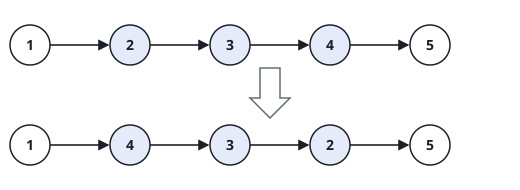

# Reverse Whole List II

## Description

This is the stretch version of turning a list around. Given the `head` of a
singly linked list and two positions `left` and `right` with
`left <= right`, flip the run of nodes that sits between those two positions
— in place, leaving every node outside the run where it stands — and return
the list that results. Positions count from 1 at the head.

### Example 1



```text
Input: head = [1,2,3,4,5], left = 2, right = 4
Output: [1,4,3,2,5]
Explanation: the run covering positions 2 through 4 (2 → 3 → 4) flips to
4 → 3 → 2, while the nodes holding 1 and 5 never move.
```

### Example 2

```text
Input: head = [1,2,3], left = 1, right = 2
Output: [2,1,3]
Explanation: the run starts at the head itself, so the list grows a new
first node and the old head slides into second place.
```

### Example 3

```text
Input: head = [6,7,8,9], left = 1, right = 4
Output: [9,8,7,6]
Explanation: with the run spanning every position, the whole list ends up
reversed — this is the one-list version of the task.
```

### Example 4

```text
Input: head = [3], left = 1, right = 1
Output: [3]
Explanation: a lone node reversed over itself is still that node.
```

### Constraints

- The list holds `n` nodes.
- `1 <= n <= 500`
- `-500 <= Node.val <= 500`
- `1 <= left <= right <= n`

### Follow-up

Can you manage the flip by walking the list only once?
