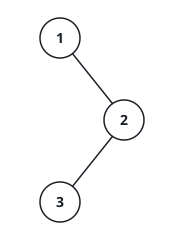
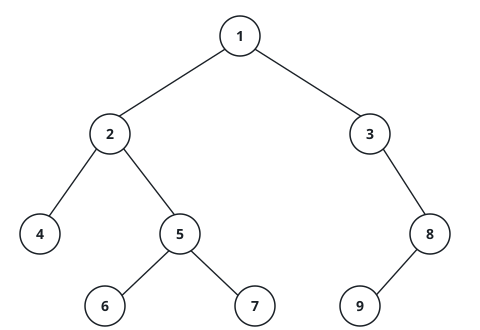

# The In-Order Walk

## Description

A binary tree can be read back in a fixed order: for every node, read
everything hanging off its left subtree first, then the node itself, then
everything hanging off its right subtree — and that rule applies again and
again inside every subtree. Reading the whole tree this way is the in-order
walk.

Given the `root` of a binary tree, return the node values in the order the
in-order walk reaches them.

### Example 1

```text
Input: root = [1,null,2,3]
Output: [1,3,2]
```



```text
Explanation: node 1 has no left subtree, so it is read first; the walk
then dips into 2's left subtree, reads 3, and comes back to 2.
```

### Example 2

```text
Input: root = [1,2,3,4,5,null,8,null,null,6,7,9]
Output: [4,2,6,5,7,1,3,9,8]
```



```text
Explanation: the walk reads every left subtree before the node anchoring
it — 4 before 2, then 6 and 7 around 5 — and only after the whole left
half of 1 is spent does it read 1, then 3, then 9 under 8.
```

### Example 3

```text
Input: root = [5,3,8,1,null,7,9]
Output: [1,3,5,7,8,9]
Explanation: the deepest leaf on the far left (1) opens the list, values
surface as the walk climbs, and 9 — the rightmost leaf — closes it.
```

### Example 4

```text
Input: root = []
Output: []
Explanation: an empty tree has no nodes to read, so the walk is empty.
```

### Constraints

- The tree holds between `0` and `100` nodes.
- Every node value sits between `-100` and `100`.

### Follow-up

The recursive version writes itself. Can you produce the same walk with
loops alone, no recursion?
