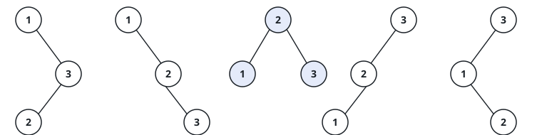

# The Shapes Of A Search Tree II

## Description

The counting companion of this problem asks how many shapes a binary search
tree over the values `1` through `n` can take; this one asks for the trees
themselves. Every value is used exactly once, the search-tree rule decides
which values may fall on each side of a node, and what remains free is the
branching — so the answer is every structurally distinct search tree on
`1` through `n`, all of them at once.

Return the trees in the order the examples show: roots run from `1` to `n`,
and for each root every left-subtree choice is paired with every
right-subtree choice, the left choice varying slower than the right, each
side's own list following the same rule recursively.

### Example 1



```text
Input: n = 3
Output: [[1,null,2,null,3],[1,null,3,2],[2,1,3],[3,1,null,null,2],[3,2,null,1]]
Explanation: five shapes — two hang (2, 3) off a root of 1, one roots 2
with a leaf on each side, and two mirror the first pair with (1, 2) under
a root of 3.
```

### Example 2

```text
Input: n = 1
Output: [[1]]
Explanation: a single value admits exactly one tree — the one-node tree.
```

### Constraints

- `1 <= n <= 8`
