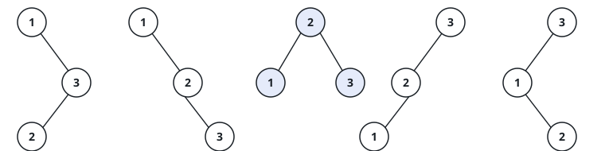

# The Shapes Of A Search Tree

## Description

Fill a binary search tree with the values `1` through `n`, each used exactly
once. The search-tree ordering pins down where every value can sit relative
to the others, but it does not pin down the branching: the same values admit
several genuinely different trees. What can vary is the shape — which value
roots the tree, and how the leftovers split between the two sides.

Given `n`, count how many structurally distinct binary search trees hold
exactly the values `1` through `n`. Two trees are the same shape when one
can be re-labeled into the other by structure alone; since the value set is
always `1` through `n` here, two trees count as one exactly when their
branching matches branch for branch.

### Example 1



```text
Input: n = 3
Output: 5
Explanation: with 1 as the root, the right side (2, 3) can hang in two
shapes; with 2 as the root, a leaf lands on each side; with 3 as the root,
the left side (1, 2) mirrors the first two shapes.
```

### Example 2

```text
Input: n = 2
Output: 2
Explanation: 1 with 2 hanging to its right, or 2 with 1 hanging to its
left — two shapes and no others.
```

### Example 3

```text
Input: n = 4
Output: 14
Explanation: choosing 1, 2, 3, or 4 as the root pairs an empty-or-larger
left side with a correspondingly smaller right side, and the counts add up
as 1·5 + 1·2 + 2·1 + 5·1 = 14.
```

### Constraints

- `1 <= n <= 19`
