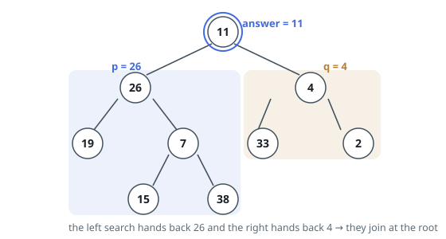

# Solutions — Deepest Shared Ancestor, Binary Tree

Two ways of finding where two root-to-target chains meet. One runs the tree
backwards: record every node's parent in one walk, then the chains become
list walks from each target upward, and the deepest shared ancestor is the
first entry of one chain seen from the other. The other is a single
recursive pass that reports the chains themselves — a subtree hands back the
target it ran into, and the first node whose two children both have something
to say is the meeting point.

## Parent Pointers

A node knows its children, not its parent — but parents are the direction the
answer lives in, because a shared ancestor is a node on both upward chains.
So the first move is to invert the tree: one stack-driven walk from the root
that records, for every node it reaches, the value of that node's parent.
Values are unique, so a value identifies its node, and the parent table is the
whole tree re-pointed upward; the root, with no parent, is simply absent from
it.

With upward edges in hand, each target's ancestry becomes a plain list walk.
Start at `p` and follow parent links to the root, collecting values into a
set — that set is exactly the nodes whose subtrees contain `p`, `p` itself
included, since a subtree contains its own root. Then start at `q` and climb:
the first value found in the set is a node containing both, and no deeper node
of `q`'s chain can be one, because every value below the meeting point on
`q`'s side was absent from `p`'s chain. The above-the-other shape needs no
special case either: when `q` sits above `p`, `q` is a member of `p`'s chain
and the climb stops on its first step; when `p` sits above `q`, the set runs
out exactly at `p`.

Both passes are linear, and the stack never holds more than the tree is wide.
What is spent is memory proportional to the tree — the parent table holds an
entry per node besides the root, and the ancestry set can hold all of them —
which is exactly what the recursive form declines to spend: it keeps only the
call stack, one frame per level, and re-derives the chains on the way up.

**Complexity:** `O(n)` time, `O(n)` space.

## Recursive Subtree Search

Nothing about a node's value predicts what is stored below it, so no subtree
can be dismissed without being walked. The way out is to have the walk return
something more useful than a boolean. Define `find(node)` to report the target
it encountered inside that subtree — the node itself when its value is `p` or
`q`, `None` when the subtree is empty or holds neither.

Reporting a value match straight away, before descending, is what makes the
above-the-other shape fall out for free: such a node returns itself while its
own descendants are never examined, so the deeper target cannot compete with
it on the way back up.

Everything else is decided at the join. A node recurses into both children; if
each side comes back with a target, that node is the first place the two are
covered together — every node below it saw at most one of them — so it is
returned upward and, because it is never overwritten by an ancestor that gets
only one non-`None` side, it survives all the way to the top. When only one
side reports, that report is passed along unchanged.

Because both targets are guaranteed present and distinct, the outermost call
always returns a real node, and its value is the answer. Every node is touched
at most once; the recursion holds one frame per level, so a tree that
degenerates into a chain of 10⁵ nodes costs that much stack — the price of the
recursive shape.

**Complexity:** `O(n)` time, `O(h)` space.
