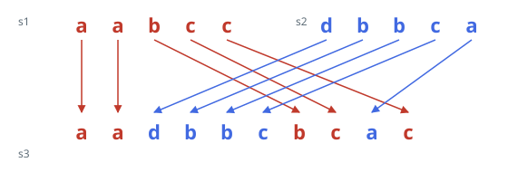

# Weaving Two Words Into One

## Description

You are given three strings `s1`, `s2`, and `s3`. Decide whether `s3` can
be produced by weaving `s1` and `s2` together into a single string.

A weave is built by reading the two words side by side and, at each step,
appending the next not-yet-used letter of either one. A word's letters are
always taken front to back — you may pick which word supplies the next
letter, but you may never skip ahead inside a word or rearrange what it
still holds. If the choices can be made so the combined output is exactly
`s3`, using up both words completely, the answer is true; otherwise it is
false.

### Example 1



```text
Input: s1 = "aabcc", s2 = "dbbca", s3 = "aadbbcbcac"
Output: true
Explanation: Take "aa" from s1, then "dbbc" from s2, then "bc" from s1,
then "a" from s2, and finally "c" from s1. The runs land end to end as
"aa" + "dbbc" + "bc" + "a" + "c" = "aadbbcbcac", each word contributing
its own letters in their original order.
```

### Example 2

```text
Input: s1 = "ab", s2 = "cd", s3 = "adbc"
Output: false
Explanation: The first letter "a" must come from s1, which then forces
the next letter "d" to come from s2. After that, "b" is still owed by s1,
but the "c" sitting ahead of "d" inside s2 can no longer be placed before
it. No sequence of choices spells s3.
```

### Example 3

```text
Input: s1 = "aab", s2 = "aac", s3 = "aaabac"
Output: true
Explanation: The three opening "a"s are forked — either word could supply
each one — so a greedy pick is not enough. One working split takes "aa"
from s1, then "a" from s2, then "b" from s1, then "ac" from s2.
```

### Constraints

- `0 <= s1.length, s2.length <= 100`
- `0 <= s3.length <= 200`
- All three strings consist only of lowercase English letters.

### Follow-up

Could you keep the extra memory down to a single row of `s2.length`
booleans?
