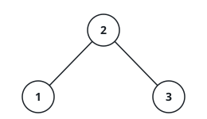
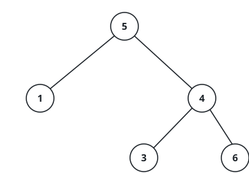

# Is This Tree A BST?

## Description

You are given the `root` of a binary tree. Report whether the tree obeys
the binary search tree (BST) ordering rule.

The rule has three parts, and all three must hold:

- every key stored in a node's left subtree is strictly smaller than that
  node's own key;
- every key stored in its right subtree is strictly larger;
- the same two requirements hold recursively for both subtrees.

Note that the rule reaches past the immediate children: a key buried deep
in the left subtree still has to be smaller than the node at the top of
that subtree, and similarly on the right.

### Example 1



```text
Input: root = [2,1,3]
Output: true
Explanation: The node holding 2 splits its descendants into 1 on the left
and 3 on the right; 1 < 2 < 3, and neither subtree hides anything out of
place, so the ordering rule holds everywhere.
```

### Example 2



```text
Input: root = [5,1,4,null,null,3,6]
Output: false
Explanation: The 4 sits in the right subtree of the root, so every key
under it — including this one — must exceed 5. The 4 does not.
```

### Constraints

- The tree holds between `1` and `10⁴` nodes.
- `-2³¹ <= Node.val <= 2³¹ - 1`
