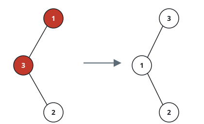
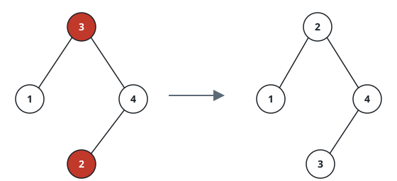

# Swap Back The BST Keys

## Description

You are given the `root` of a binary search tree (BST) whose ordering rule
is broken in exactly one way: the values stored at **two** of its nodes
were traded with each other by mistake. Find that pair and trade the two
values back. Nodes and links must stay exactly where they are — only the
two misplaced values move — and because the judge sees only what the call
hands back, return the tree's `root` after the repair: the returned tree
is the restored BST.

### Example 1



```text
Input: root = [1,3,null,null,2]
Output: [3,1,null,null,2]
Explanation: As given, the node holding 3 hangs to the left of the node
holding 1 — a left descendant must be smaller, and this one is larger.
Trading the values 1 and 3 between those two nodes restores the ascending
left-to-right reading 1, 2, 3.
```

### Example 2



```text
Input: root = [3,1,4,null,null,2]
Output: [2,1,4,null,null,3]
Explanation: The node holding 2 sits in the right subtree of the root, so
it must exceed 3 — it does not. Swapping the values 3 and 2 puts every
subtree back inside its proper range.
```

### Constraints

- The tree holds between `2` and `1000` nodes.
- `-2³¹ <= Node.val <= 2³¹ - 1`

### Follow-up

An approach with `O(n)` extra memory is easy to come by. Can you perform
the repair using only constant extra memory?
