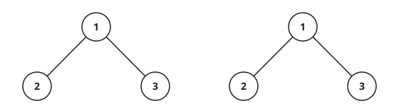
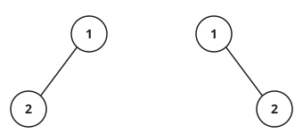
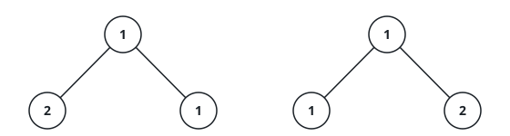

# Do The Two Trees Match?

## Description

You are given the roots `p` and `q` of two binary trees. Decide whether the
two trees are twins of each other: they qualify when they have exactly the
same shape — every position that holds a node in one holds a node in the
other — and every aligned pair of nodes stores the same value.

A missing child counts as part of the shape, so a tree whose root has only
a left child never matches a tree of the same values whose root has only a
right child.

### Example 1



```text
Input: p = [1,2,3], q = [1,2,3]
Output: true
Explanation: Both trees hold 1 at the root with 2 on the left and 3 on the
right. Every position lines up and every value agrees.
```

### Example 2



```text
Input: p = [1,2], q = [1,null,2]
Output: false
Explanation: The 2 hangs to the left in the first tree and to the right in
the second. The values are the same but the shapes are not.
```

### Example 3



```text
Input: p = [1,2,1], q = [1,1,2]
Output: false
Explanation: The roots agree, but the aligned children hold 2 against 1
and 1 against 2, so the values fail to line up.
```

### Constraints

- Each tree holds between `0` and `100` nodes.
- `-10⁴ <= Node.val <= 10⁴`
