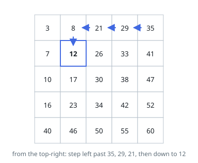
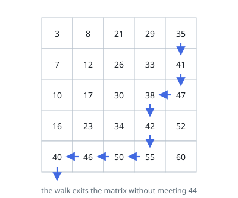

# Sorted Matrix Membership

## Description

You are given an `m x n` integer matrix `matrix` and an integer `target`.
Return `true` if `target` occurs somewhere in the matrix and `false` if it
does not.

The matrix is sorted twice over: reading any row from left to right the values
increase, and reading any column from top to bottom they increase as well. The
matrix is _not_ sorted as a whole — a value can be smaller than one that sits
above and to the right of it.

### Example 1

```text
Input: matrix = [[3,8,21,29,35],[7,12,26,33,41],[10,17,30,38,47],[16,23,34,42,52],[40,46,50,55,60]], target = 12
Output: true
```



### Example 2

```text
Input: matrix = [[3,8,21,29,35],[7,12,26,33,41],[10,17,30,38,47],[16,23,34,42,52],[40,46,50,55,60]], target = 44
Output: false
Explanation: 44 would belong between 41 and 47, but neither row nor column
holds it.
```



### Example 3

```text
Input: matrix = [[-5,-1,4],[2,3,8]], target = 2
Output: true
Explanation: The matrix need not be square, and values may be negative.
```

### Constraints

- `m == matrix.length` and `n == matrix[i].length`
- `1 <= m, n <= 300`
- Every entry, and `target` itself, lies between `-10^9` and `10^9`.
- Each row reads in ascending order, and so does each column.

## Hints

### Hint 1

Which cell tells you the most when you compare it with the target? The
top-right one is the biggest in its row and the smallest in its column, so
whichever way the comparison falls, it rules out a whole line of cells.

### Hint 2

Too big means the target cannot be anywhere in that column, since the rest of
the column is bigger still — drop the column and step left. Too small means the
target cannot be anywhere in that row — drop the row and step down.

### Hint 3

Each step retires one row or one column, so the walk is over in at most
`m + n` comparisons. Running a binary search in every row also works but costs
`m log n`, which is worse once the matrix is anywhere near square.
