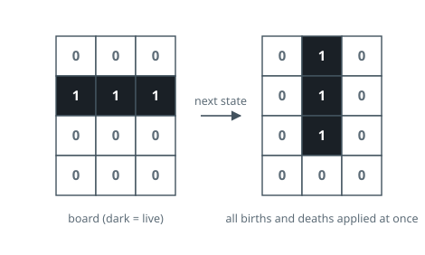
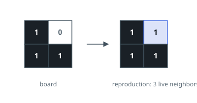

# Life, One Generation

## Description

A rectangular board of `m` rows and `n` columns holds cells that are either
alive (`1`) or dead (`0`). Every cell has up to eight neighbours — the cells
sharing a row, a column, or a diagonal with it — and the board changes in
generations, all at once, by these rules:

- a live cell with no live neighbour, or exactly one, dies;
- a live cell with two or three live neighbours stays alive;
- a live cell with four or more live neighbours dies;
- a dead cell with exactly three live neighbours comes alive.

Every other cell stays as it was. The rules read the old board only: all
births and deaths in one generation take effect together.

Given `board`, apply exactly one generation and return the board you produced.

### Example 1

```text
Input: board = [[0,0,0],[1,1,1],[0,0,0],[0,0,0]]
Output: [[0,1,0],[0,1,0],[0,1,0],[0,0,0]]
Explanation: The middle row of three live cells turns into a middle column.
The two outer live cells die — one live neighbour each — while the cells
directly above and below the centre come alive with exactly three.
```



### Example 2

```text
Input: board = [[1,0],[1,1]]
Output: [[1,1],[1,1]]
Explanation: The one dead corner sees three live neighbours and is born; the
three live cells each keep two or three and survive.
```



### Example 3

```text
Input: board = [[1,0,0],[0,0,0]]
Output: [[0,0,0],[0,0,0]]
Explanation: A lone live cell has no live neighbours at all and cannot
survive the generation.
```

### Constraints

- `m == board.length`
- `n == board[i].length`
- `1 <= m, n <= 25`
- Each cell holds `0` or `1`.

### Follow-up

- Can the next generation be written into the same board, given that the rules
  must all be evaluated against the old one before any cell changes?
- A real Life board has no edge. Here the array ends — what would you change
  if live cells could keep spreading past the border you are given?

## Hints

### Hint 1

Simultaneity is the trap: overwriting a cell early lets its neighbours read a
state from the wrong generation. Every decision has to be made from the board
as it was handed to you.

### Hint 2

A cell can carry both generations at once. Two marker values are enough — say
`2` for "was alive, will die" and `3` for "was dead, will be born" — after
which one final pass restores plain `0`s and `1`s.

### Hint 3

Counting neighbours needs only the old state, and the old state stays
recoverable: `1` and `2` both meant alive, `0` and `3` both meant dead. Anything
off the board counts as dead.
