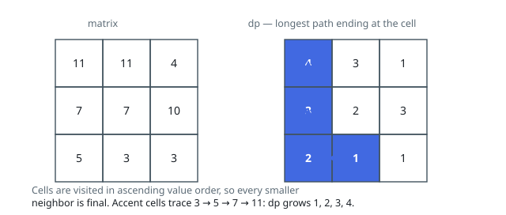

# Solutions — Longest Ascending Grid Path

## Value-Ordered DP over the Cell DAG

Every legal step climbs to a strictly larger value, so no walk can return to
a cell it has left — the grid is a directed acyclic graph whose edges point
from each cell to its larger four-direction neighbors. Longest-path on a DAG
wants a topological order, and ascending value order is one for free.

The solver sorts every cell by value and keeps `dp[i][j]`, the length of the
longest ascending walk starting at `(i, j)`, seeded at 1 for the walk of the
cell alone. Cells are then processed smallest first; when a cell's turn
comes, each strictly smaller neighbor has already been finalized (it sits
earlier in the sorted order), so `dp[i][j]` is one plus the largest `dp`
among those neighbors, and the running maximum absorbs it. The transition
compares with strict `<`, so equal-valued neighbors never link: strict
ascent is enforced by the comparison itself, and the relative order of
equal-valued cells in the sort is immaterial because none of them reads the
others.

Written bottom-up, the sort does the work a memoized DFS recursion would do,
with no recursion depth and no visited bookkeeping. Plateaus of equal values
need no care — a plateau contributes no edges at all, which is why the pairs
of equal 11s, 7s and 3s in the first example leave its single four-step
walk unbeaten.

Boundaries: a 1×1 grid returns 1 from the initialization, and an empty input
returns 0 up front. Sorting the `m · n` cells dominates the two linear grid
sweeps; the DP table and sorted cell list hold the space.

**Complexity:** `O(mn log(mn))` time, `O(mn)` space.
