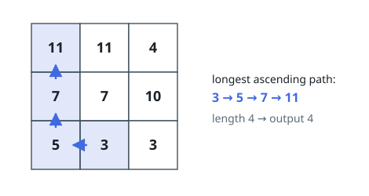
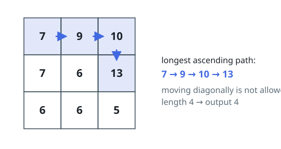

# Longest Ascending Grid Path

## Description

Given an `m x n` grid of integers, find the length of the longest path that
steps from cell to cell, always moving to a strictly larger value.

Each step moves one cell up, down, left, or right; diagonal steps and steps
outside the grid are not allowed. A single cell on its own is a path of
length 1 — return the greatest length achievable.

### Example 1

```text
Input: matrix = [[11,11,4],[7,7,10],[5,3,3]]
Output: 4
Explanation: The longest path collects 3, 5, 7, 11 in that order, starting
at the bottom-middle cell and climbing to the top-left corner.
```



### Example 2

```text
Input: matrix = [[7,9,10],[7,6,13],[6,6,5]]
Output: 4
Explanation: The longest path collects 7, 9, 10, 13: three steps along the
top row, then one down. A shorter-looking diagonal shortcut to 13 does not
exist, since diagonal steps are not allowed.
```



### Example 3

```text
Input: matrix = [[7]]
Output: 1
Explanation: The lone cell is itself a path of length 1.
```

### Constraints

- `m == matrix.length`
- `n == matrix[i].length`
- `1 <= m, n <= 200`
- `0 <= matrix[i][j] <= 2³¹ - 1`

## Hints

### Hint 1

The longest ascending path leaving any fixed cell is a constant — compute it
once and reuse it rather than re-walking the same suffix.

### Hint 2

Strict ascent means every step lands on a strictly larger value, so no walk
can revisit a cell: the grid is a directed acyclic graph with edges toward
larger neighbors.

### Hint 3

Acyclicity invites a topological fill: visiting cells from smallest value to
largest, set `dp[cell] = 1 + max(dp)` over its smaller-valued neighbors.

### Hint 4

The answer is the largest entry of `dp`; every cell alone already
contributes 1.
