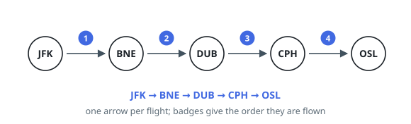

# Order Every Flight

## Description

Each entry of `flights` is a pair `[origin, destination]` describing one
flight, written as two airport codes. Every flight has to be flown exactly
once, and the journey starts at `"JFK"`.

Return the airports in the order they are visited. The answer is one longer
than `flights`, it begins with `"JFK"`, and each consecutive pair in it is one
of the given flights, consumed once.

When more than one order works, compare two candidates airport by airport and
keep the one whose first differing code comes earlier in the alphabet; that is
the answer to return. At least one valid order is guaranteed to exist.

### Example 1

```text
Input: flights = [["BNE","DUB"],["JFK","BNE"],["CPH","OSL"],["DUB","CPH"]]
Output: ["JFK","BNE","DUB","CPH","OSL"]
Explanation: The flights chain together in only one way, and the order they
appear in the input has nothing to do with it.
```



### Example 2

```text
Input: flights = [["JFK","CDG"],["CDG","JFK"],["JFK","AMS"]]
Output: ["JFK","CDG","JFK","AMS"]
Explanation: AMS sorts before CDG, but flying to AMS first ends the journey
there with two flights unused, so the alphabetically earlier choice is not
available here.
```

### Example 3

```text
Input: flights = [["JFK","LIM"],["LIM","JFK"],["JFK","LIM"],["LIM","GRU"]]
Output: ["JFK","LIM","JFK","LIM","GRU"]
Explanation: The same pair of airports is connected twice, and both copies are
flown.
```

### Constraints

- `1 <= flights.length <= 300`
- each entry holds exactly two airport codes
- an airport code is exactly `3` uppercase English letters
- no flight leaves and lands at the same airport

## Hints

### Hint 1

Read the airports as vertices and the flights as directed edges. Spending every
edge exactly once, starting from a fixed vertex, is the classic Eulerian path
question.

### Hint 2

Keep each airport's departures sorted, so the alphabetically earliest one that
is still unused is always the next candidate.

### Hint 3

Taking the earliest candidate and committing to it can fail: that airport may
be a dead end while flights elsewhere are still unused. Instead descend
depth-first, and append an airport to a list only once every flight leaving it
has been spent.

### Hint 4

That list comes out backwards — reverse it. Dead ends were appended early, so
reversing drops them at the latest position they can occupy, which is exactly
what the alphabetical rule wants.
