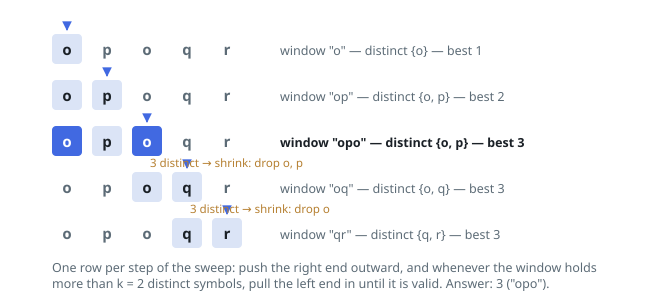

# Solutions — Longest Window of At Most K Symbols

## Sliding window with symbol counts

Hold a window `[left, right]` plus a hash map of multiplicities: for each symbol inside, how many copies the window contains. The right end advances one character at a time; as soon as the map carries more than `k` keys, the left end walks forward — decrement the count of `s[left]`, deleting the key when its count hits zero — until the window is back within budget. At the close of each iteration the window is the longest valid one that ends at `right`, so the answer is the largest `right - left + 1` observed over the whole sweep.

Validity is monotone, which is why the two-ended sweep loses nothing: a window over budget makes every window containing it over budget too, so no candidate is skipped by shrinking, and a one-character extension raises the distinct count by at most one, so the shrink is always short. Both ends travel only forward, so each character enters the window once and leaves at most once.

The loop shape absorbs the edges by itself: at `k = 0` every extension is immediately followed by a shrink that empties the window, and the function returns 0; a string that fits inside the first valid window never triggers a shrink at all. The map never holds more than `k + 1` keys, because the shrink fires the instant the `(k + 1)`-th symbol appears.

**Complexity:** `O(n)` time, `O(k)` space.
