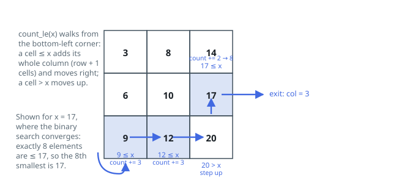

# Solutions — Select Kth Smallest in a Grid

## Binary search on the value range with a staircase count

The grid offers no position order that lists its values, so the search runs
over *values* instead: everything of interest lies between `grid[0][0]` and
`grid[n-1][n-1]`. The count of entries at most `x` never decreases as `x`
grows, which makes it a valid bisection predicate — the loop keeps the
smallest value whose count reaches `k`, and that value is the answer. It is
genuinely present in the grid: were it not, one step lower would leave the
count just as large, so that lower value would also reach `k` and the kept
value would not have been smallest.

Counting is where row-and-column sortedness earns its keep. Start at the
bottom-left cell. When the cell is at most `x`, every cell above it in the
same column is too, so the walk banks `row + 1` and moves right; otherwise the
cell exceeds `x` and so does everything to its right in that row, so the walk
moves up. Every move retires a row or a column, so after at most `2n` moves
the count is complete — `O(n)` work, nothing stored beyond two indices, which
is what lets the whole method clear the sub-`O(n²)` memory bar.

The loop halves the value range until its ends meet, and `hi` moves down on
every successful count, so it terminates on a value the predicate accepted —
never a midpoint that was rejected. Repeated values need no special casing:
`count` tallies cells, not distinct values, so the two 1s of
`[[1,2],[1,3]]` contribute two positions and `k = 2` correctly returns 1. A
`1 x 1` grid returns immediately, and negative entries are harmless because
both ends of the searched range come from the grid itself.

**Complexity:** `O(n log(max − min))` time, `O(1)` space.
