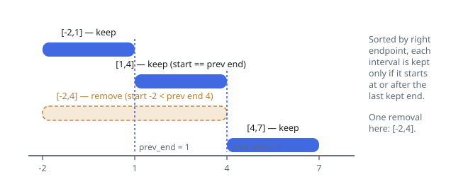

# Solutions — Minimum Interval Removals

## Greedy by Earliest End

Choose the largest compatible subset, then remove everything outside it. Sort
intervals by their right endpoint and retain the earliest-ending available
interval. Any alternative compatible choice ending later leaves no more room
for future intervals, so it can be exchanged for the greedy choice without
reducing the number retained.

Track the end of the last retained interval. A new interval is compatible when
its start is greater than or equal to that end; equality is allowed because
touching endpoints do not overlap. Otherwise, count it as removed and leave
the tracked endpoint unchanged.

Sorting ties causes no difficulty: only one of several identical intervals is
retained. A separate empty-state marker is used before the first choice because
zero and negative endpoints are valid.

**Complexity:** `O(n log n)` time and `O(n)` space for the sorted copy.
