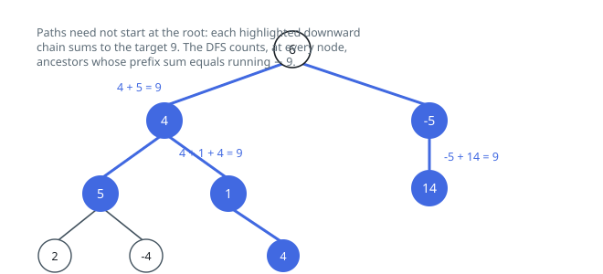

# Solutions — Count Paths With Sum

## Prefix Sums on the Tree

Attach to each node the total of the values from the root down to it, and call
it `prefix`. For a downward chain running from `u` down to `v`, every node the
chain covers is counted in `prefix(v)` and every node strictly above it is
counted in both totals, so the chain's sum is `prefix(v) - prefix(parent(u))`.
The question "which chains end at `v` and total `targetSum`?" therefore becomes
"which nodes above `v` carry the total `prefix(v) - targetSum`?" — the same
counting move that solves the array version of this problem, moved onto a tree.

One depth-first traversal is enough. It carries `running`, the total down to the
node it is standing on, and a tally mapping a total to how many nodes of the
current root-to-node path carry it. On arrival the traversal adds
`tally[running - targetSum]` to the answer, then records `running` itself before
descending into the two children. The tally starts holding one copy of `0`,
which stands for the empty spot above the root; that entry is what lets a chain
starting at the node being visited be counted.

The one step with no counterpart in the array version is the withdrawal: after
both children return, the node removes its own `running` from the tally. Without
it, a total banked while walking the left subtree would still be sitting there
when the right subtree is explored, and the pair of nodes it matched lie on no
common downward chain. Withdrawing on the way out keeps the tally equal to
exactly the ancestors of wherever the traversal currently is — precisely the set
of legal upper ends.

Two details keep it honest. The node registers its own total *after* its lookup,
so it never pairs with itself unless the target is `0`, which is the correct
answer for a one-node chain of value `0`. And with a thousand nodes worth `10⁹`
each, the running totals do not fit in 32 bits, so they are accumulated in a
wider type; the tally keys are arbitrary integers, so negative values need no
special handling. An empty tree falls straight out of the null check with `0`.

**Complexity:** `O(n)` time — one visit per node, constant expected work each —
and `O(n)` space for the tally and the recursion, which a chain of 1000 nodes
drives to its full depth.
