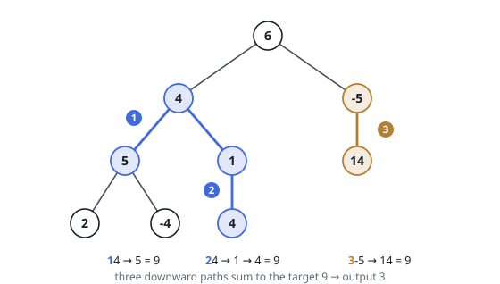

# Count Paths With Sum

## Description

Given the `root` of a binary tree and an integer `targetSum`, count the
downward chains of nodes whose values add up to `targetSum`.

A downward chain is a node, then one of its children, then one of that child's
children, and so on — a single node on its own is a chain of length one. Neither
end of a chain has to be the root or a leaf, and chains that overlap are counted
separately.

### Example 1

```text
Input: root = [6,4,-5,5,1,null,14,2,-4,null,4], targetSum = 9
Output: 3
Explanation: Three chains reach 9; none of them begins at the root.
```



### Example 2

```text
Input: root = [3,3,null,3], targetSum = 3
Output: 3
Explanation: Each of the three nodes is a one-node chain worth 3. Longer chains
here reach 6 or 9.
```

### Example 3

```text
Input: root = [2,-1,4,3,null,null,-3], targetSum = 1
Output: 2
Explanation: 2 → -1 on the left, and 4 → -3 on the right.
```

### Constraints

- The tree holds at most `1000` nodes and may be empty.
- Every node value lies in `[-10⁹, 10⁹]`.
- `-1000 <= targetSum <= 1000`

## Hints

### Hint 1

Give every node the total of the values from the root down to it. The sum of a
downward chain is then the difference of two such totals — the one at its lower
end minus the one just above its upper end.

### Hint 2

Visiting a node with running total `running`, the chains ending there that hit
the target are the ancestors whose total is `running - targetSum`. Carry a tally
of the totals seen along the current root-to-node path so that count is one
lookup.

### Hint 3

Put a single `0` in the tally before you start, so a chain that begins at the
node you are visiting is counted too.

### Hint 4

Take the node's own total back out of the tally as the traversal leaves it.
Otherwise totals recorded in one subtree would pair with nodes in the other,
and those two nodes lie on no common downward chain.

### Hint 5

A thousand nodes at `10⁹` apiece overflow 32 bits — accumulate the running
totals in a wider integer type.
