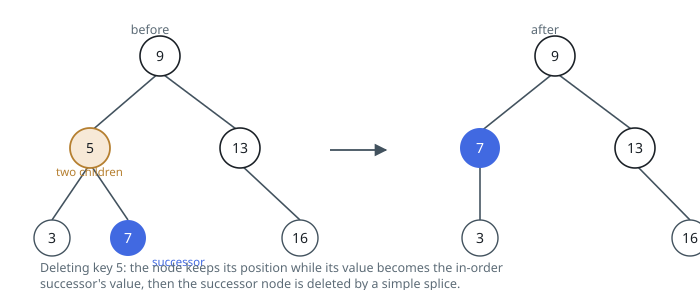

# Solutions — BST Node Removal

## Recursive descent with successor replacement

The removal walks down the tree with the search-tree rule as its guide —
left when `key` is below the node's value, right when above — and each
recursive call hands back the subtree to hang on that side, so the tree
repairs itself on the way back up. A descent that falls off the bottom means
the value is absent (or the tree was empty to begin with) and nothing moves.

Finding the target splits into cases. A node missing its left child is
replaced by its right child, and one missing its right child by its left;
the leaf situation is both at once and the node simply disappears. Lifting a
whole subtree this way cannot break the ordering, because everything inside
it stays on the same side of every ancestor it crosses.

Two children is the case that needs care. The node's value is overwritten
with its in-order successor's — the minimum of the right subtree, reached by
stepping left from the right child until no left child remains. That value
is larger than the whole left subtree and smaller than the rest of the
right, so planting it at the node leaves a valid search tree. The duplicate
now sitting in the successor's node is cleared by recursing into the right
subtree with the successor's value; that call necessarily meets a node with
no left child and ends in the easy splice case.

Only the values along one root-to-leaf band are ever touched — the descent,
the successor walk, and the follow-up splice all stay inside it — so the
work tracks the height. A completely lopsided tree of 10^4 nodes is the
worst case for both running time and recursion depth.

**Complexity:** `O(h)` time and `O(h)` recursion stack, where `h` is the
height of the tree.
