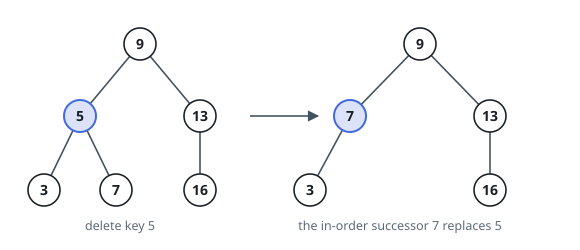
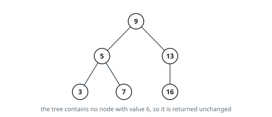

# BST Node Removal

## Description

You are given the root of a binary search tree and a value `key`. Take the
node holding `key` out of the tree — keeping every remaining value in a valid
search tree — and return the root of the result. If no node holds `key`, the
tree comes back untouched.

The exact result is pinned down by one rule. When the node being removed has
two children, its value is replaced by its in-order successor's value — the
smallest value in its right subtree — and the successor node is then removed
from that right subtree. Leaf and single-child removals have only one
outcome. Judging compares the serialized tree, so follow the rule as stated.

Trees are serialized level by level, with `null` marking a missing child and
trailing `null`s dropped.

### Example 1

```text
Input: root = [9,5,13,3,7,null,16], key = 5
Output: [9,7,13,3,null,null,16]
Explanation: 5 has two children. Its in-order successor is 7, the smallest
value in the right part of its subtree, so 7's value takes 5's place and the
node that held 7 is spliced away.
```



### Example 2

```text
Input: root = [9,5,13,3,7,null,16], key = 6
Output: [9,5,13,3,7,null,16]
Explanation: No node holds 6, so the tree is returned as it came.
```



### Example 3

```text
Input: root = [], key = 8
Output: []
Explanation: An empty tree stays empty.
```

### Constraints

- The tree has between `0` and `10^4` nodes.
- `-10^5 <= Node.val <= 10^5`
- Every node holds a distinct value.
- The input obeys the binary-search ordering: left subtrees hold smaller
  values, right subtrees larger.
- `-10^5 <= key <= 10^5`

Follow-up: can you remove the node in time proportional to the height of the
tree?

## Hints

### Hint 1

Descend by the search-tree rule — toward the left child when `key` is smaller
than the node's value, toward the right when it is larger — and rewire the
child link on the way back up.

### Hint 2

A node with at most one child is easy: the remaining subtree slides into the
node's spot, still on the correct side of every ancestor. This also settles
the leaf case.

### Hint 3

With two children, the smallest value of the right subtree is greater than
everything on the left and the least of the right — plant it in the node, then
remove its old holder, which by construction has no left child.
