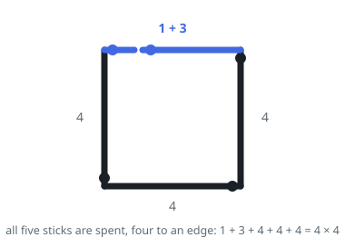

# Square From Sticks

## Description

Every entry of `lengths` gives the length of one straight stick. Sticks may be
laid end to end to build a longer run, but none may be cut and none may be set
aside. Decide whether the whole pile can outline a square: four runs of equal
length, with each stick lying on exactly one of them.

Return `true` when the pile can, and `false` when it cannot.

### Example 1

```text
Input: lengths = [1,3,4,4,4]
Output: true
Explanation: The three sticks of length 4 each become an edge on their own, and
the remaining 1 and 3 join end to end to make the fourth edge.
```



### Example 2

```text
Input: lengths = [2,2,3,3,3,3]
Output: false
Explanation: The pile totals 16, so an edge would have to measure 4. The two
short sticks make one edge, but a 3 can neither stand alone nor be paired with
another 3 without overshooting.
```

### Example 3

```text
Input: lengths = [7,7,7]
Output: false
Explanation: 21 does not divide into four equal runs at all.
```

### Constraints

- `lengths` contains at least `1` and at most `15` values
- each length is an integer from `1` to `10^8`

## Hints

### Hint 1

Four equal edges means each edge carries exactly a quarter of the pile's total
length. A total that is not a multiple of four settles the question before any
searching, and so does a stick longer than that quarter.

### Hint 2

What remains is an assignment: send every stick to one of four edges, never
letting an edge pass the quarter. Recurse over the sticks, branching four ways
at each.

### Hint 3

The only state worth carrying is how full each of the four edges currently is.
Which particular sticks landed on an edge changes nothing about what can go
there next.

### Hint 4

Two cheap prunings shrink the tree enormously: place the longest sticks first so
dead ends surface near the root, and, for a given stick, skip any edge whose
current fill repeats one you have already tried — those branches are the same
branch.
