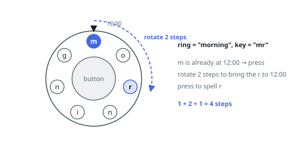

# Dial Spelling Steps

## Description

A circular dial carries the letters of a string `ring` around its rim, one
letter per position, and a fixed marker points at the top position (12
o'clock). Initially `ring[0]` sits at the marker. A second string `key` must
be spelled out letter by letter, and the only actions available are:

- rotate the dial one position clockwise or counterclockwise, either
  direction costing one step, or
- press the center button, which spells whatever letter currently sits at
  the marker and costs one step.

To spell `key[i]`, rotate until some position holding that letter arrives at
the marker — any occurrence of the letter will do — then press. Consecutive
letters of `key` may reuse the same occurrence without rotating again.

Return the fewest total steps needed to spell all of `key`.

### Example 1

```text
Input: ring = "morning", key = "mr"
Output: 4
Explanation: The dial starts with 'm' at the marker, so spelling it costs
just one press. The only 'r' sits two positions away, so rotating twice and
pressing adds 3 more: 1 + 2 + 1 = 4.
```



### Example 2

```text
Input: ring = "morning", key = "ring"
Output: 10
Explanation: One optimal play: rotate 2 to the 'r' and press (3), rotate 2
to the 'i' and press (3 more), rotate 1 to the 'n' at position 5 and press
(2 more), then rotate 1 onward to the 'g' and press (2 more). Choosing the
'n' at position 5 rather than the one at position 3 shortens the last leg;
the total is 3 + 3 + 2 + 2 = 10.
```

### Example 3

```text
Input: ring = "a", key = "aaa"
Output: 3
Explanation: The dial never needs to move; three presses do all the work.
```

### Constraints

- `1 <= ring.length, key.length <= 100`
- `ring` and `key` contain only lowercase English letters
- every letter of `key` occurs somewhere in `ring`

## Hints

### Hint 1

Between letters, the past matters only through one fact: which dial position
currently faces the marker. Make that part of your state.

### Hint 2

Moving position `i` to the marker-facing slot of position `j` on a circle of
`n` letters costs `min(|i - j|, n - |i - j|)` rotations, whichever direction
is shorter — and every letter of `key` adds exactly one press.

### Hint 3

Sweep `key` left to right carrying a map from marker-facing position to
cheapest steps so far; fold in the press count once, at the end.
