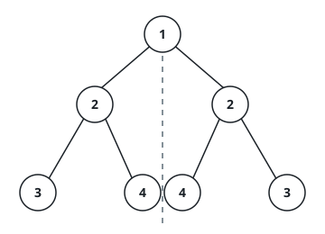
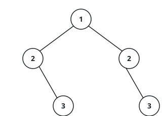

# Does The Tree Mirror Itself?

## Description

Drop a vertical line through the root of a binary tree and look at the two halves it
throws across that line. The tree mirrors itself when each half is the other's exact
reflection: every left position has a right-hand partner holding the same value at the
same position, and the pairing keeps crossing as you descend — a node's outer child is
checked against its partner's outer child, its inner child against the inner one, all
the way to the leaves.

Given the `root` of a binary tree, decide whether the tree mirrors itself around its
center.

### Example 1



```text
Input: root = [1,2,2,3,4,4,3]
Output: true
```

Both subtrees under the root read 2; below them the outer pair meets 3 against 3 and
the inner pair meets 4 against 4, so every position finds its reflection.

### Example 2



```text
Input: root = [1,2,2,null,3,null,3]
Output: false
```

The two 3s are both outer children here, not crossed to opposite sides, so the halves
are not reflections of each other.

### Example 3

```text
Input: root = [5,4,4,3,7,7,3]
Output: true
```

With 4 under the root on both sides, the outer pair compares 3 with 3 and the inner
pair 7 with 7 — the deeper level keeps the symmetry alive.

### Constraints

- The tree holds between 1 and 1000 nodes.
- Each node's value lies between -100 and 100, inclusive.

### Follow-up

Answer the question twice: once with recursion, and once without it, driving the
comparison with an explicit work list instead of call frames.
