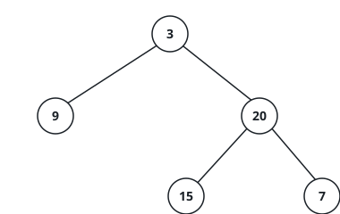

# Binary Tree Height

## Description

A tree's height is measured by its longest trip away from the top: start at the root,
walk down whichever branches run deepest, and count every node you step on until the
path dead-ends at a leaf. That count — the number of nodes on the longest
root-to-leaf path — is the height.

Given the `root` of a binary tree, return its height. An empty tree has height 0.

### Example 1



```text
Input: root = [3,9,20,null,null,15,7]
Output: 3
```

The path 3 → 20 → 15 (or equivalently 3 → 20 → 7) touches three nodes, and no path
runs longer.

### Example 2

```text
Input: root = [10,null,4,8,null,null,2]
Output: 4
```

Only rightward branches exist here: 10 → 4 → 8 → 2 is the single deepest path, four
nodes long.

### Example 3

```text
Input: root = [6,3,9,1]
Output: 3
```

The 6 → 3 → 1 path reaches three nodes; the right branch stops one node short.

### Constraints

- The tree holds between 0 and 10⁴ nodes.
- Each node's value lies between -100 and 100, inclusive.
