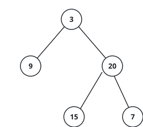

# Rebuild The Tree From Two Traversals

## Description

A single walk through a tree rarely pins its shape down, but two walks from two
different rules do. An in-order walk reports each subtree as left part, then the
subtree's own root, then right part; a post-order walk reports the parts first and
each subtree's root last. Read together, those two listings cancel out every
ambiguity — the post-order listing keeps handing you the next root to place, and the
in-order listing tells you at each placement exactly which values fall to its left
and which to its right.

You are given two integer arrays, `inorder` and `postorder`: the in-order walk and the
post-order walk of one and the same binary tree. Rebuild that tree and return its
root.

### Example 1



```text
Input: inorder = [9,3,15,20,7], postorder = [9,15,7,20,3]
Output: [3,9,20,null,null,15,7]
```

The final 3 of the post-order walk names the overall root; the in-order walk then
splits the remaining values into {9} left of it and {15,20,7} right of it, and the
argument repeats on both parts.

### Example 2

```text
Input: inorder = [4,2,6,5,7], postorder = [4,6,7,5,2]
Output: [2,4,5,null,null,6,7]
```

Value 2 roots the tree with 4 as its whole left side; on the right, 5 roots the
subtree with 6 and 7 as its two children.

### Example 3

```text
Input: inorder = [1,2,3], postorder = [3,2,1]
Output: [1,null,2,null,3]
```

Every root here has an empty left side, so the tree leans entirely to the right and
the two walks confirm the chain one level at a time.

### Constraints

- `1 <= inorder.length <= 3000`
- `postorder.length == inorder.length`
- `-3000 <= inorder[i], postorder[i] <= 3000`
- All values in `inorder` are distinct, and likewise in `postorder`.
- Every value of `postorder` also appears in `inorder`.
- `inorder` is guaranteed to be the in-order walk of some binary tree.
- `postorder` is guaranteed to be the post-order walk of that same tree.
