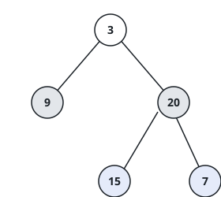

# Levels From The Bottom Up

## Description

Reading a tree row by row normally starts where the tree starts — at the root — and
works downward. This one runs the other way: gather each level's values left to
right as usual, but report the ground floor first and climb, so the leaf level leads
and the root's lone value closes the answer.

Given the `root` of a binary tree, return its levels as lists of values ordered from
the deepest level up to the first.

### Example 1



```text
Input: root = [3,9,20,null,null,15,7]
Output: [[15,7],[9,20],[3]]
```

The leaves 15 and 7 are reported together first; their parents 9 and 20 follow, and
the root 3 comes in last.

### Example 2

```text
Input: root = [12,5,18,3,8]
Output: [[3,8],[5,18],[12]]
```

Three levels stack up here, and the bottom one — the two children of 5 — is what
the answer opens with.

### Example 3

```text
Input: root = [-7]
Output: [[-7]]
```

A lone node is both the top and the bottom level, so the answer holds that single
one-element list.

### Example 4

```text
Input: root = [9,4,13,null,7,null,15,2]
Output: [[2],[7,15],[4,13],[9]]
```

Four levels climb out of this tree: the deepest leaf 2 alone, then its cousins 7 and
15, then their parents, then the root.

### Constraints

- The tree holds between 0 and 2000 nodes.
- Each node's value lies between -1000 and 1000, inclusive.
