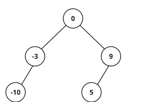
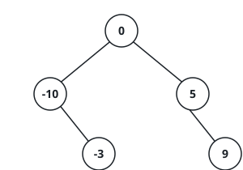
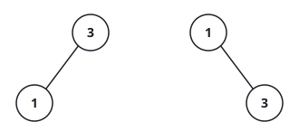

# Balanced Tree From A Sorted Array

## Description

A sorted array is a search tree waiting to happen: ascending order is exactly the
left-to-right order a binary search tree visits its nodes in, so the values already
have their in-order positions picked out. What is left is to choose the tree's shape,
and the natural choice is the most even one — root each piece of the array at its
middle value, then split what remains into the two sides and keep going until every
value has been placed. Each node's left side then holds only smaller values and its
right side only larger ones, and no node's two subtrees ever differ in height by more
than one.

You are given an integer array `nums` sorted in strictly increasing order. Build a
height-balanced binary search tree from it and return the root.

Several balanced trees fit one array, but the judge compares the returned tree
exactly, so the build has to be deterministic. Root each sorted segment at its middle
element — when a segment's length is even and two elements share the middle, the
**second** one takes the root. The elements before that middle become the left
subtree, the ones after it the right subtree.

### Example 1



```text
Input: nums = [-10,-3,0,5,9]
Output: [0,-3,9,-10,null,5]
```



0 sits at the middle of the five values. The left segment [-10,-3] roots at -3 (the
second of its two middles) with -10 beneath it; the right segment [5,9] roots at 9
with 5 beneath it.

### Example 2



```text
Input: nums = [1,3]
Output: [3,1]
```

The segment's two middles are 1 and 3, so the second — 3 — becomes the root and 1
hangs to its left.

### Example 3

```text
Input: nums = [4,9,14,20,26,31,35]
Output: [20,9,31,4,14,26,35]
```

An odd-length segment has one true middle: 20 roots the tree, and the two halves
root themselves at 9 and 31 in the same way.

### Example 4

```text
Input: nums = [6,11,16,21,26,31]
Output: [21,11,31,6,16,26]
```

Even length: the tie-break promotes 21 over 16 to the root, 11 carries 6 and 16 on
the left, and the right segment [26,31] roots at 31 with 26 as its only child.

### Constraints

- `1 <= nums.length <= 10⁴`
- `-10⁴ <= nums[i] <= 10⁴`
- `nums` is sorted in strictly increasing order.
