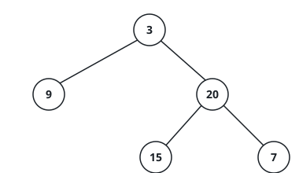

# Does The Tree Split Evenly?

## Description

You are given the `root` of a binary tree. Call the tree **evenly split**
when no node gives its two sides wildly different amounts of room: at
every node, the height of the left subtree and the height of the right
subtree differ by at most one. Report whether the whole tree qualifies.

Here the height of a subtree counts the levels along its longest downward
chain, so a lone node has height one and an absent child height zero. The
check applies to every node, not just the root — a tree whose top is
perfectly balanced can still fail deep inside one of its halves.

### Example 1



```text
Input: root = [3,9,20,null,null,15,7]
Output: true
Explanation: The root's left side is a single node and its right side
spans two levels; the gap is one. Both inner nodes are leaves with two
empty sides, so no node anywhere breaks the one-level rule.
```

### Example 2


```text
Input: root = [1,2,2,3,3,null,null,4,4]
Output: false
Explanation: Below the root, the left subtree reaches three levels while
the right subtree stops after one. That gap of two at the very top
disqualifies the tree, no matter how tidy the deeper nodes are.
```

### Example 3

```text
Input: root = [1,2,3,4,null,null,null,5]
Output: false
Explanation: The left subtree chains through 2, 4 and 5 for three levels
while the right subtree is the lone node 3, so the root sees a gap of two.
```

### Example 4

```text
Input: root = [6,4,9,2,5,7,11]
Output: true
Explanation: Every leaf sits on the same level and each internal node
holds two children, so every split is dead even.
```

### Constraints

- The tree holds between `0` and `5000` nodes.
- `-10⁴ <= Node.val <= 10⁴`
