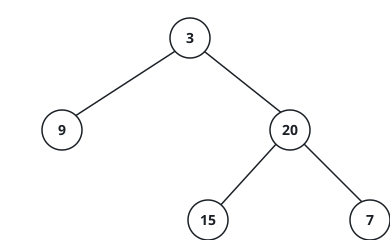

# The Shortest Walk To A Leaf

## Description

You are given the `root` of a binary tree. Measure the shortest walk that
starts at the root and ends at a leaf, and report how many nodes that walk
visits. A leaf is a node with no children on either side. An empty tree
offers no walk at all, so its answer is zero.

The one rule that trips careful readers: only a genuine leaf ends the walk.
A node with a single child is not finished, even though one of its sides is
empty — the walk is forced to continue down through the child it does have.

### Example 1



```text
Input: root = [3,9,20,null,null,15,7]
Output: 2
Explanation: The node holding 9 sits one level below the root and has no
children, so the walk root → 9 visits just two nodes.
```

### Example 2

```text
Input: root = [1,null,2,null,3,null,4]
Output: 4
Explanation: Every node hands the walk to a right child only, so the walk
must run the whole chain down to the leaf holding 4 — four nodes in all.
```

### Example 3

```text
Input: root = [7,5,12,3,6]
Output: 2
Explanation: The node holding 12 sits two levels deep with no children.
Leaves 3 and 6 hide a level further down, but the walk stops at 12.
```

### Constraints

- The tree holds between `0` and `10⁵` nodes.
- `-1000 <= Node.val <= 1000`
