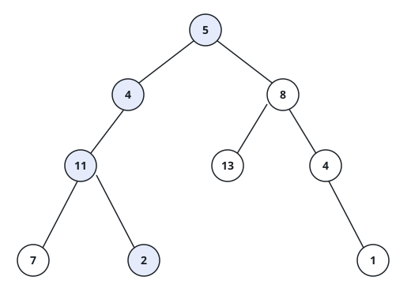
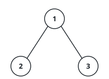

# Root-To-Leaf Totals

## Description

You are given the `root` of a binary tree and an integer `targetSum`.
Decide whether the tree contains a **root-to-leaf** path whose values add
up to exactly `targetSum`. A root-to-leaf path starts at the root, moves
only downward, and stops at a **leaf** — a node with no children.

Both endpoints matter: the walk must reach all the way down to a leaf, so
a prefix of a path that happens to hit the target partway down does not
count, and an empty tree has no such path at all.

### Example 1



```text
Input: root = [5,4,8,11,null,13,4,7,2,null,null,null,1], targetSum = 22
Output: true
Explanation: Following the marked branch down — 5, then 4, 11 and 2 — the
values add up to 22, and the walk ends on a leaf.
```

### Example 2



```text
Input: root = [1,2,3], targetSum = 5
Output: false
Explanation: The tree has exactly two root-to-leaf walks, 1 → 2 and
1 → 3, totaling 3 and 4. Neither reaches 5.
```

### Example 3

```text
Input: root = [8,4,12,2,6,null,16], targetSum = 18
Output: true
Explanation: The walk 8 → 4 → 6 collects 18 and stops on a leaf.
```

### Example 4

```text
Input: root = [3,9,20,null,null,15,7], targetSum = 18
Output: false
Explanation: The walks total 12 (3 → 9), 38 (3 → 20 → 15) and 30
(3 → 20 → 7) — none of them reaches 18 on a leaf.
```

### Constraints

- The tree holds between `0` and `5000` nodes.
- `-1000 <= Node.val <= 1000`
- `-1000 <= targetSum <= 1000`
