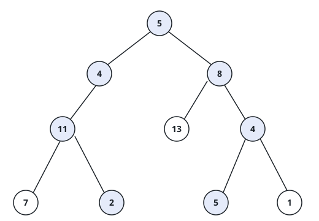

# Root-To-Leaf Totals II

## Description

You are given the `root` of a binary tree and an integer `targetSum`.
Collect **all** root-to-leaf paths whose values add up to exactly
`targetSum`. As in the first problem of this pair, a root-to-leaf path
runs from the root downward and stops at a **leaf** — a node with no
children — and each path is reported as the list of values it visits,
not as node references.

The output keeps every match in discovery order, reading the tree left
before right; two different walks may spell out the same list of values,
and both belong in the answer.

### Example 1



```text
Input: root = [5,4,8,11,null,13,4,7,2,null,null,5,1], targetSum = 22
Output: [[5,4,11,2],[5,8,4,5]]
Explanation: Two walks land on 22: down the left branch, 5 + 4 + 11 + 2,
and down the right branch, 5 + 8 + 4 + 5.
```

### Example 2


```text
Input: root = [1,2,3], targetSum = 5
Output: []
Explanation: The walks total 3 and 4, so nothing matches 5.
```

### Example 3

```text
Input: root = [8,4,12,2,6,null,16], targetSum = 18
Output: [[8,4,6]]
Explanation: Only the walk through 8, 4 and 6 reaches 18 on a leaf; the
right-hand walk totals 36.
```

### Example 4

```text
Input: root = [1,2,2,3,null,null,3], targetSum = 6
Output: [[1,2,3],[1,2,3]]
Explanation: Both leaves holding 3 complete a walk of 6, and the two
matching paths are reported in left-to-right order.
```

### Constraints

- The tree holds between `0` and `5000` nodes.
- `-1000 <= Node.val <= 1000`
- `-1000 <= targetSum <= 1000`
