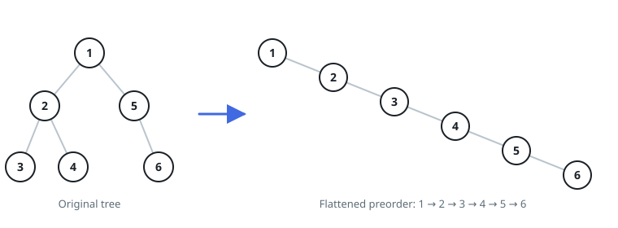

# The Preorder Chain Rewrite

## Description

You are handed the `root` of a binary tree and must rewire it into one
linear chain. Every node keeps its identity and its stored value, but the
finished structure obeys two rules: each node's `right` pointer leads to
the next node of the chain, and every `left` pointer ends up empty. The
order of the nodes along the chain is exactly the order a pre-order
traversal of the original tree visits them — node first, then the whole
left subtree, then the whole right subtree.

The judge reads only what the method gives back, so do the rewiring and
return the head of the finished chain — the same node the tree began
with, now carrying every other node behind it along `right` edges.

### Example 1



```text
Input: root = [1,2,5,3,4,null,6]
Output: [1,null,2,null,3,null,4,null,5,null,6]
Explanation: Read pre-order — 1, then the left subtree 2, 3, 4, then the
right subtree 5, 6 — and that is precisely the chain the right pointers
trace once every left pointer has been cleared.
```

### Example 2

```text
Input: root = [4,2,6,1,3,5,7]
Output: [4,null,2,null,1,null,3,null,5,null,6,null,7]
Explanation: Pre-order leaves the root first, drains the entire left
subtree (2, 1, 3), and only then climbs into the right subtree (5 and its
two children), so the chain follows that visit order link by link.
```

### Example 3

```text
Input: root = [6,5,null,4,null,3]
Output: [6,null,5,null,4,null,3]
Explanation: The tree leans left at every level, yet the rewired chain
still reads top to bottom along the same nodes — no value ever moves,
only pointers.
```

### Constraints

- The tree holds between `0` and `2000` nodes.
- `-100 <= Node.val <= 100`

### Follow-up

Can you produce the chain without any auxiliary memory — no recursion
stack, no extra collection — relinking the existing nodes only?

## Hints

### Hint 1

Follow the finished chain and notice it replays a pre-order walk. That
tells you exactly where a displaced right subtree belongs: the node that
pre-order visits last inside the left subtree — its rightmost
descendant — is the one that should adopt the old right subtree before
the left subtree swings across.
