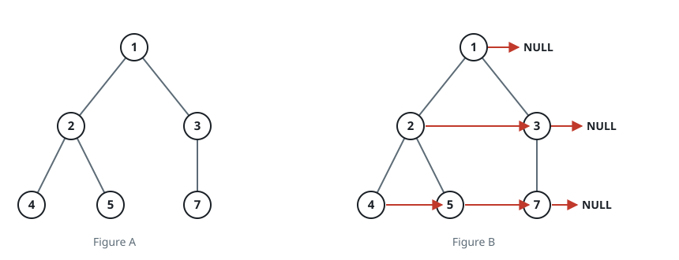

# Every Node's Right-Hand Neighbor II

## Description

Like its perfect-tree predecessor, this task hands you the `root` of a
binary tree whose nodes carry a spare `next` slot, and asks you to thread
each node to its immediate neighbor on the same level — its right-hand
neighbor — leaving `next` empty wherever a node ends its level.

The difference is the tree itself: nothing is guaranteed here. Interior
nodes may have a single child or none at all, leaves may sit on different
levels, and a level can even consist of one lone node. Every `next` slot
starts out empty.

The judge reads the result back through the `next` links: the returned
value is the level-by-level sequence traced from the root, with a single
`null` separator between adjacent levels and nothing after the last one.

### Example 1



```text
Input: root = [1,2,3,4,5,null,7]
Output: [1,null,2,3,null,4,5,7]
Explanation: The missing slot belongs to 6, so 5's right-hand neighbor is
not 6's child but 7: 2 points at 3, 4 points at 5, 5 points at 7, and 1,
3, and 7 close their levels.
```

### Example 2

```text
Input: root = [7,3,null,null,5]
Output: [7,null,3,null,5]
Explanation: Each level here holds a single node, so every `next` slot
ends up empty — the output still reads level by level through the links.
```

### Example 3

```text
Input: root = [9,4,12,null,6,null,15,3]
Output: [9,null,4,12,null,6,15,null,3]
Explanation: Gaps never break the threading: 4 points at 12, 6 points at
15, and the lone leaf 3 starts the deepest level on its own.
```

### Constraints

- The tree holds between `0` and `6000` nodes.
- `-100 <= Node.val <= 100`

### Follow-up

- Only constant extra space is allowed.
- A recursive solution is acceptable — implicit stack space does not
  count against the constant-space requirement.

## Hints

### Hint 1

Perfection carried the predecessor, and its absence is exactly what breaks
that trick here — a node's right sibling may not exist, so "bridge to the
next parent's child" no longer lands anywhere fixed. What still works: a
level whose `next` pointers are already wired is a linked list, so walk it
left to right once, appending every child you meet to a chain you build
for the level below.
