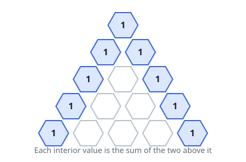

# Pascal's Staircase II

## Description

Given an integer `rowIndex`, return just one row of Pascal's staircase —
the one at position `rowIndex`, counting from zero — rather than the whole
structure.

The rows obey the same rule as in _Pascal's Staircase_: each row begins
and ends with a `1`, and every interior value is the sum of the two values
directly above it in the previous row, as in



Row `i` holds `i + 1` values, so the answer for `rowIndex` is one list of
`rowIndex + 1` numbers.

### Example 1

```text
Input: rowIndex = 5
Output: [1,5,10,10,5,1]
Explanation: The row is symmetric, and its interior values 5, 10, 10, 5
each total one diagonal pair from row 4.
```

### Example 2

```text
Input: rowIndex = 4
Output: [1,4,6,4,1]
Explanation: The middle value 6 comes from summing the 3 and 3 that sit
above it in row 3.
```

### Example 3

```text
Input: rowIndex = 33
Output: [1,33,528,5456,40920,237336,1107568,4272048,13884156,38567100,92561040,193536720,354817320,573166440,818809200,1037158320,1166803110,1166803110,1037158320,818809200,573166440,354817320,193536720,92561040,38567100,13884156,4272048,1107568,237336,40920,5456,528,33,1]
Explanation: The largest row the constraints allow — thirty-four values,
still comfortably inside 32-bit range at its twin peaks of 1,166,803,110.
```

### Constraints

- `0 <= rowIndex <= 33`

### Follow-up

Could you build the requested row using only `O(rowIndex)` extra space?
