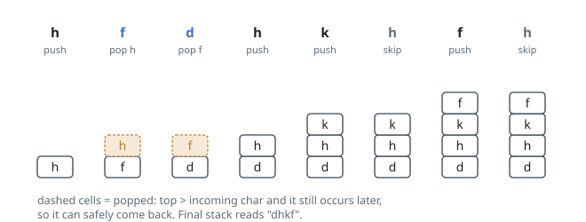

# Solutions — Smallest Letter Subsequence

## Greedy Monotonic Stack with Remaining Counts

Three properties define the answer: it is a subsequence of `s`, it contains
each distinct letter exactly once, and it is lexicographically first among all
strings with the first two properties. The construction maintains a stack and
acts on a local-exchange argument: when the incoming letter is smaller than
the stack top and that top still has an occurrence later in `s`, removing the
top now and letting its later copy supply it can only make the prefix smaller
— nothing is lost and the front of the string strictly improves.

Two bookkeeping structures make each such decision safe and constant-time.
A `count` map holds, for every letter, how many occurrences remain _after_
the current position, decremented as the scan consumes characters; the pop
test `count[stack[-1]] > 0` is then exactly "is discarding the top
reversible?". An `in_stack` set enforces the exactly-once rule: a letter
already placed is skipped outright, since a second copy could never improve
the result and its occurrence may be needed after some smaller letter.

One pass suffices: consume a character, decrement its count, skip it if
placed, otherwise pop while the top is larger and re-occurable, then push.
Although the inner pop loop looks nested, each letter enters the stack at
most once and leaves at most once, so the whole run amortizes to linear work;
the auxiliary structures never exceed the 26-letter alphabet.

The example `s = "hfdhkhfh"` exercises every rule. The first `h` is dropped
when `f` arrives (an `h` still waits later), and `f` in turn is dropped for
`d`; after that the stack grows `d, h, k`, the middle `h` is skipped as
already placed, the returning `f` stops on top of `k` — `k` never occurs
again, so popping it is irreversible — and the final `h` is skipped. The
stack reads `dhkf`. At the other extreme, `"twisted"` shows the blocked case:
`s`, `e` and `d` each occur once, so nothing can pass them, and the answer is
the string itself with the second `t` dropped.

**Complexity:** `O(n)` time, `O(1)` space.
