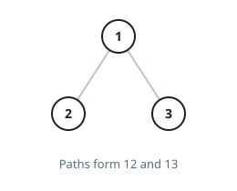
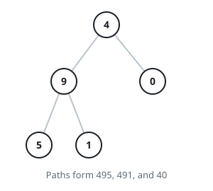

# The Root-To-Leaf Number Total

## Description

You are handed the `root` of a binary tree whose every node stores a single
digit, `0` through `9`.

Read each root-to-leaf path as one decimal number: walking `7 -> 4 -> 0`
spells `740`, because every step down shifts the digits collected so far one
place left and appends the new node's digit at the end.

Add up the numbers spelled by all root-to-leaf paths and return the total.
Test data guarantees the total fits in a 32-bit integer. A **leaf** is a
node with no children.

### Example 1



```text
Input: root = [1,2,3]
Output: 25
Explanation: The path down the left child reads 12 and the path down the
right child reads 13, so the total is 12 + 13 = 25.
```

### Example 2



```text
Input: root = [4,9,0,5,1]
Output: 1026
Explanation: The two paths through the 9 read 495 and 491, while the
shorter path ending at the 0 reads 40. Together: 495 + 491 + 40 = 1026.
```

### Example 3

```text
Input: root = [7,4,2,0,5]
Output: 1557
Explanation: The left subtree spells 740 and 745, the right child is
itself a leaf spelling 72, and 740 + 745 + 72 = 1557.
```

### Constraints

- The tree holds between `1` and `1000` nodes.
- Every node's value is a digit from `0` to `9`.
- The tree's depth never exceeds `10`.
