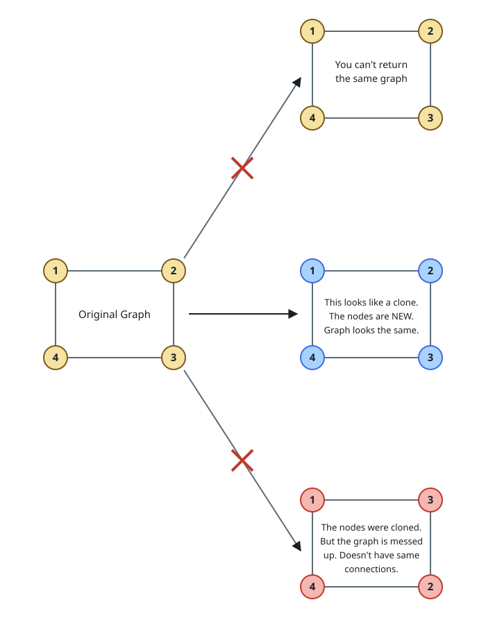
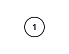

# Deep Copy Of A Graph

## Description

You are handed a reference to one node of a **connected, undirected**
graph, and must build a complete deep copy of the whole thing.

Every node of the graph carries an integer value and a list of the nodes
it is directly joined to:

```text
class GraphNode {
    val: integer
    neighbors: list of GraphNode
}
```

A deep copy means brand-new nodes: the copy shares no node object with
the original, but every corresponding pair of nodes holds the same value
and its clone's neighbor list joins the same corresponding clones, so the
copy has exactly the shape of the original.

Test cases describe the graph by an **adjacency list**: one row per node,
listing the values of that node's neighbors, in no particular order. A
node's value always equals its position — the node with `val = 1` is the
first row, `val = 2` the second, and so on — and the node you are handed
is always the one with `val = 1`. Return the clone of that same node as
your way in to the copied graph.

### Example 1



```text
Input: adjList = [[2,4],[1,3],[2,4],[1,3]]
Output: [[2,4],[1,3],[2,4],[1,3]]
Explanation: The graph has four nodes, each joined to two others: node 1
to nodes 2 and 4, node 2 to nodes 1 and 3, node 3 to nodes 2 and 4, and
node 4 to nodes 1 and 3. The copy reproduces all four nodes and all eight
neighbor slots.
```

### Example 2



```text
Input: adjList = [[]]
Output: [[]]
Explanation: The single row holds no neighbors: the graph is one node
with value 1 and nothing attached to it.
```

### Example 3

```text
Input: adjList = []
Output: []
Explanation: No rows at all means an empty graph with nothing to copy.
```

### Example 4

```text
Input: adjList = [[2,3],[1,3],[1,2]]
Output: [[2,3],[1,3],[1,2]]
Explanation: Three nodes joined in a triangle: 1-2, 1-3, and 2-3. The
clone wires up the same three edges between fresh nodes.
```

### Constraints

- The graph holds between `0` and `100` nodes.
- `1 <= Node.val <= 100`, and no two nodes share a value.
- Every edge is listed once per endpoint; there are no self-loops.
- The graph is connected: every node is reachable from the given one.
