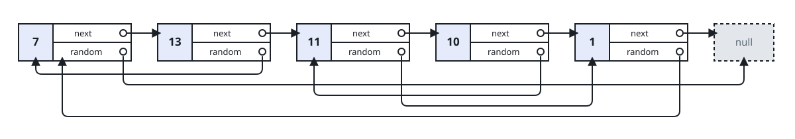
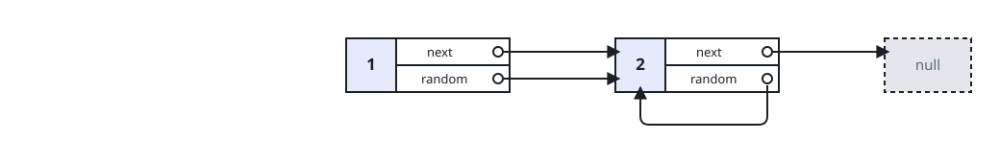
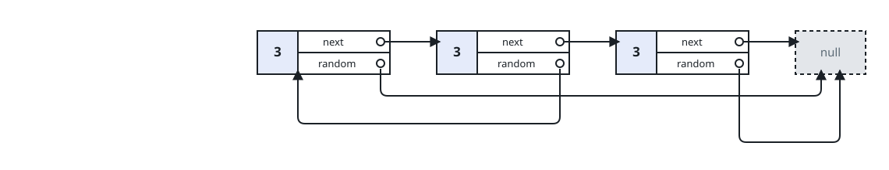

# Copying The Random-Pointer List

## Description

You are given the `head` of a linked list of `n` nodes. Each node holds a
value plus one extra **random pointer**, which may aim at any node in the
list — one further along, one behind, even the node itself — or at
nothing at all.

Build a deep copy of the list: exactly `n` brand-new nodes, each carrying
the value of its corresponding original, with `next` and `random` wired to
the fresh nodes that stand in the same positions. No pointer in the copy
may reach back into the original. Where `X.random` aims at `Y` in the
original, the copy's `x.random` must aim at the copy's `y`.

Return the head of the copied list.

The list travels to you as `head` alone, and the judge reads the answer
back as one `[val, random_index]` row per node, where `random_index` is
the position (from `0` to `n-1`) of the node the random pointer aims at,
or `null` when it aims nowhere.

### Example 1



```text
Input: head = [[7,null],[13,0],[11,4],[10,2],[1,0]]
Output: [[7,null],[13,0],[11,4],[10,2],[1,0]]
Explanation: Every random pointer here lands on an earlier node — 13
aims back at 7, 11 at the trailing 1, 10 at 11, and 1 at 7 — so the copy
must reproduce five fresh nodes with the same five aims.
```

### Example 2



```text
Input: head = [[1,1],[2,1]]
Output: [[1,1],[2,1]]
Explanation: Both random pointers aim at the second node — position 1 —
including node 2's, which aims at itself.
```

### Example 3



```text
Input: head = [[3,null],[3,0],[3,null]]
Output: [[3,null],[3,0],[3,null]]
Explanation: All three nodes carry the same value 3, so only the wiring
tells them apart: the middle node's random pointer is the only one that
aims anywhere, back at the head, and the copy reproduces exactly that.
```

### Example 4

```text
Input: head = [[1,2],[3,null],[7,0]]
Output: [[1,2],[3,null],[7,0]]
Explanation: This time the pointers reach forward — the head aims at the
last node and leapfrogs the middle, whose own pointer aims at nothing.
```

### Constraints

- `0 <= n <= 1000`
- `-10⁴ <= Node.val <= 10⁴`
- Each node's random pointer is `null` or aims at some node of the list.

## Hints

### Hint 1

A single node can be the random target of many others at once, so
whatever builds the copy must guarantee one clone per original — never
one per reference.

### Hint 2

Keeping a note of each original node together with the clone made for it
lets a revisit reuse the existing clone instead of allocating a second
one.

### Hint 3

That note does not need a table of its own: splice every clone into the
original chain directly after its original — A → A' → B → B' → C → C'
— and the pairing can be read straight off the interleaved list.

### Hint 4

With the two lists interleaved by `next`, a clone's random target sits
one step past its own original's random target; a final pass then
unsplices the pair into two clean lists.
