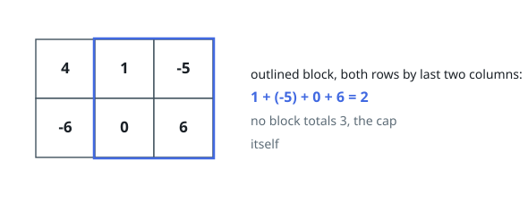

# Capped Submatrix Sum

## Description

`matrix` has `m` rows and `n` columns of integers, and `k` is a cap. A _block_
is any set of cells picked out by a range of consecutive rows and a range of
consecutive columns; its value is the sum of the cells inside it.

Return the largest block value that does not exceed `k`. Some block is
guaranteed to satisfy the cap, so an answer always exists.

### Example 1

```text
Input: matrix = [[4,1,-5],[-6,0,6]], k = 3
Output: 2
Explanation: The block covering both rows and the last two columns totals 2.
Larger totals exist — the two cells in the top-left corner make 5 — but they
break the cap, and no block totals exactly 3.
```



### Example 2

```text
Input: matrix = [[-1,2],[3,-4]], k = -2
Output: -2
Explanation: The cap is negative, so the answer has to be too. The right-hand
column, taken over both rows, totals -2.
```

### Example 3

```text
Input: matrix = [[1,4,-2,3]], k = 5
Output: 5
Explanation: A single row still has blocks: every stretch of consecutive
entries. The whole row reaches 6, one over the cap, so the best allowed is the
first two entries at 5.
```

### Constraints

- `m` is the number of rows and `n` the number of columns, with
  `1 <= m, n <= 100`
- every cell satisfies `-100 <= matrix[i][j] <= 100`
- the cap satisfies `-10^5 <= k <= 10^5`

### Follow-up

Suppose the grid is very tall and only a few columns wide. Which loop should
run over which dimension?

## Hints

### Hint 1

Pin down the top and bottom row of the block first. There are fewer than
`m^2 / 2` such pairs, and once they are fixed the block is determined by its
column range alone.

### Hint 2

For a fixed row pair, add up each column between those rows. That collapses the
grid into a single array, and every block in that band is a stretch of
consecutive entries in it. Extending the bottom row by one costs a single pass
over the array, so the collapsing is nearly free.

### Hint 3

In the collapsed array, a stretch's total is one running sum minus an earlier
one. To make the difference as large as possible without passing `k`, you want
the _smallest_ earlier running sum that is still at least `current - k`.

### Hint 4

Hold the running sums seen so far in a structure that answers "smallest value
at or above x" quickly — a sorted list with binary search, or a balanced tree —
and seed it with zero so a stretch starting at the first column is considered.
