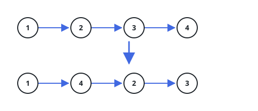

# Fold The List Around Its Middle

## Description

You are given the `head` of a singly linked list. Written out as a chain, the
list reads

L0 → L1 → … → Ln - 1 → Ln

Folding it around its middle alternates the outermost remaining nodes inward,
so the chain becomes

L0 → Ln → L1 → Ln - 1 → L2 → Ln - 2 → …

Node values are off limits: you may not write a new value into any node. The
reordering has to happen by re-aiming the nodes' own `next` pointers, and
this judge reads the returned list, so return the `head` of the folded list —
the same node you were handed, now leading the new order.

### Example 1



```text
Input: head = [1,2,3,4]
Output: [1,4,2,3]
```

### Example 2


```text
Input: head = [1,2,3,4,5]
Output: [1,5,2,4,3]
```

### Example 3

```text
Input: head = [10,3,8,1,9,2]
Output: [10,2,3,9,8,1]
Explanation: the outer pair 10 and 2 lands first, then the next pair 3 and
9, and the middle node 8 stays put at the end.
```

### Constraints

- The number of nodes in the list is in the range `[1, 5 × 10⁴]`.
- `1 <= Node.val <= 1000`
