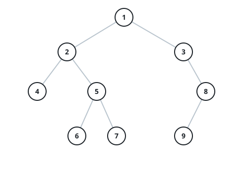

# The Pre-Order Walk

## Description

A binary tree can be read back in a fixed order: for every node, read the
node itself first, then everything hanging off its left subtree, then
everything hanging off its right subtree — the same rule applied again and
again inside every subtree. Reading the whole tree this way is the pre-order
walk.

Given the `root` of a binary tree, return the node values in the order the
pre-order walk reaches them.

### Example 1

```text
Input: root = [1,null,2,3]
Output: [1,2,3]
```


```text
Explanation: 1 is read on arrival; its left subtree is empty, so the walk
steps right, reads 2, and finishes with 2's left child 3.
```

### Example 2

```text
Input: root = [1,2,3,4,5,null,8,null,null,6,7,9]
Output: [1,2,4,5,6,7,3,8,9]
```



```text
Explanation: after 1, the entire left side is spent before the right side
is touched — 2, its left leaf 4, then 5 with 6 and 7 under it — and only
then come 3 and 8 with 9 hanging off 8's left.
```

### Example 3

```text
Input: root = [3,1,4,null,2]
Output: [3,1,2,4]
Explanation: 3 opens the list; the left subtree (1, then 1's right child
2) is used up completely before 4 is ever reached.
```

### Example 4

```text
Input: root = []
Output: []
Explanation: an empty tree has no nodes to read, so the walk is empty.
```

### Constraints

- The tree holds between `0` and `100` nodes.
- Every node value sits between `-100` and `100`.

### Follow-up

The recursive version writes itself. Can you produce the same walk with
loops alone, no recursion?
