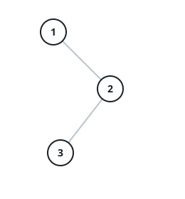

# The Post-Order Walk

## Description

A binary tree can be read back in a fixed order: for every node, read
everything hanging off its left subtree first, then everything hanging off
its right subtree, and only then the node itself — the same rule applied
again and again inside every subtree. Reading the whole tree this way is the
post-order walk.

Given the `root` of a binary tree, return the node values in the order the
post-order walk reaches them.

### Example 1

```text
Input: root = [1,null,2,3]
Output: [3,2,1]
```



```text
Explanation: 1 has no left subtree, so the walk starts in its right
subtree, where 3 — the leaf under 2 — is read before 2, and 1 itself
closes the list.
```

### Example 2

```text
Input: root = [1,2,3,4,5,null,8,null,null,6,7,9]
Output: [4,6,7,5,2,9,8,3,1]
```


```text
Explanation: every node waits for both of its subtrees — 4 opens the list,
5's children 6 and 7 land before 5, the whole left half drains before 3,
and 1, the root, is read last.
```

### Example 3

```text
Input: root = [3,1,4,null,2]
Output: [2,1,4,3]
Explanation: the left subtree reports first — 2 before 1 — then 4's empty
subtrees let it through, and 3 closes the walk.
```

### Example 4

```text
Input: root = []
Output: []
Explanation: an empty tree has no nodes to read, so the walk is empty.
```

### Constraints

- The tree holds between `0` and `100` nodes.
- Every node value sits between `-100` and `100`.

### Follow-up

The recursive version writes itself. Can you produce the same walk with
loops alone, no recursion?
