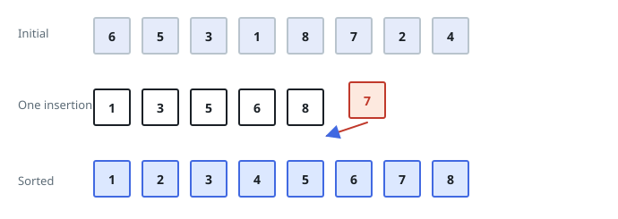
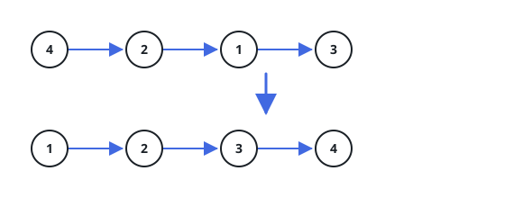
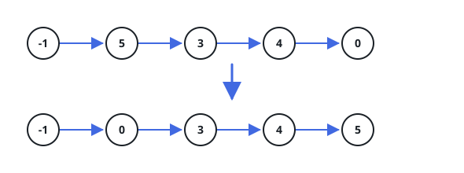

# Sort The List By Insertion

## Description

You are given the `head` of a singly linked list. Sort the list with
**insertion sort** and return the head of the sorted list.

Insertion sort builds its result one node at a time. It keeps a run of nodes
that is already in order, takes a single node out of what remains, walks that
run until it finds where the node belongs, and links it in there — repeating
until no unsorted nodes are left.

The picture below shows the algorithm in action: the in-order run (black)
begins holding just the first node, and each pass lifts one node (red) out of
the unsorted remainder and slots it into place inside the run.



### Example 1



```text
Input: head = [4,2,1,3]
Output: [1,2,3,4]
```

### Example 2



```text
Input: head = [-1,5,3,4,0]
Output: [-1,0,3,4,5]
```

### Example 3

```text
Input: head = [6,-2,4,-8,0]
Output: [-8,-2,0,4,6]
Explanation: each node leaves the unsorted front and lands directly in its
final slot; the negative values end up at the head of the run.
```

### Constraints

- The number of nodes in the list is in the range `[1, 5000]`.
- `-5000 <= Node.val <= 5000`

### Follow-up

Could you sort the linked list in `O(n log n)` time using `O(1)` memory?
