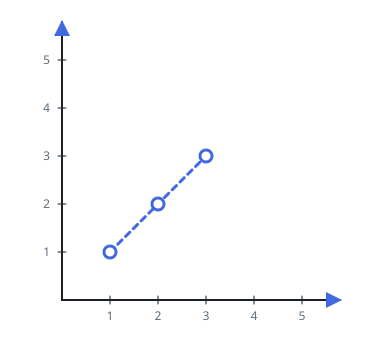
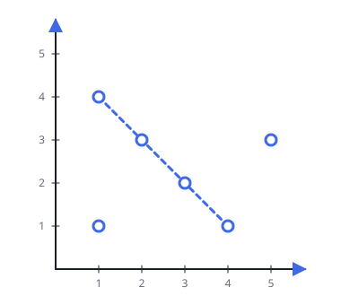

# The Most Points On One Line

## Description

A set of points is given on the X-Y plane, one coordinate pair per point.
Some of them happen to share a straight line — a diagonal, a column, a
row, or any slanted line in between. Find how many points the single most
crowded such line passes through, and report that count.

Every point counts toward exactly the lines it lies on, and the answer
is at least `1`, since a lone point always forms a degenerate line of
its own.

### Example 1



```text
Input: points = [[1,1],[2,2],[3,3]]
Output: 3
Explanation: All three points climb the diagonal `y = x`, so one line
collects the whole set.
```

### Example 2



```text
Input: points = [[1,1],[3,2],[5,3],[4,1],[2,3],[1,4]]
Output: 4
Explanation: The four points `(1,4)`, `(2,3)`, `(3,2)` and `(4,1)` all
satisfy `x + y = 5`, and no other line gathers more than two.
```

### Constraints

- `1 <= points.length <= 300`
- `points[i].length == 2`
- `-10⁴ <= xi, yi <= 10⁴`
- All the points are distinct — no coordinate pair repeats.
