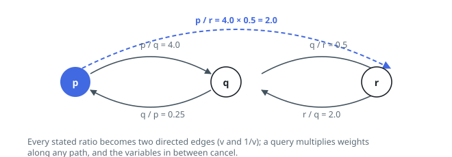

# Solutions — Resolve Ratios

Both routes rest on the same pin: a stated ratio is reversible — `a / b = v`
read backwards is `b / a = 1 / v` — so the batch partitions the variables
into groups whose members' quotients are all fixed once any member's is. The
graph search answers each query by navigation, sweeping out of one variable
and multiplying arrow labels until the other turns up. The union-find does
that walking once, ahead of time: each stated ratio merges its two variables
into one rooted tree while every member keeps its quotient to the root, so a
query collapses to two root-relative ratios and one division.

## Weighted graph BFS

Build a graph whose vertices are the variable names. A stated ratio `a / b = v`
contributes the arrow `a -> b` labelled `v`, and — because flipping a quotient
inverts it — the arrow `b -> a` labelled `1 / v` as well. A query then stops
being arithmetic and becomes navigation: walk any route from `c` to `d`,
multiply the labels you cross, and the intermediate names cancel in pairs, so
what survives is precisely `c / d`.

Each query gets its own breadth-first sweep out of `c`, every queue entry
carrying the product accumulated on the way to it. Expanding a vertex offers its
neighbours `product * label`, a `seen` set stops the sweep from circling (a
round trip contributes a factor of exactly 1 anyway), and the moment `d` turns up
as a neighbour the answer is returned. Consistency of the input is what licenses
stopping at the first route found: every route between two variables carries the
same product, so there is no better one to look for.

Two rejections happen before any traversal. If either name is absent from the
graph the answer is `-1.0`, which is also the right reply when an unknown name is
divided by itself; a name that is present divided by itself is `1.0` with no
arrows crossed. Otherwise, a sweep that exhausts the component holding `c`
without meeting `d` proves the two lie in unconnected groups — the situation of
`m / v` in Example 2 — and that query is `-1.0` too.

**Complexity:** `O(Q·(V + E))` time, where `Q` counts the queries, `V` the
distinct variables and `E` the stated ratios, and `O(V + E)` space.

## Weighted union-find

A stated ratio is a merge order. Keep a forest in which every variable links
to a parent and carries `weight[x] = x / parent[x]`; the product along a
parent chain then telescopes to the member's ratio to its root — the very
quotient the BFS has to re-derive for every query. Folding `a / b = v` in
means hanging one root under the other: with `a = ratio_a · root_a` and
`b = ratio_b · root_b`, the identity `a = v · b` solves to
`root_b / root_a = ratio_a / (v · ratio_b)`, which becomes the hung root's
weight.

`find` walks up to the root while folding the chain into one quotient, then
re-hangs every node it visited directly on the root — path compression — so
the forest flattens itself as it is used, and union by size hangs the smaller
tree under the larger to keep the chains short in the first place. A ratio
whose two variables already share a root merely restates a fact the forest
encodes — the batch never contradicts itself — so the merge is skipped.

A query then costs two finds. A name absent from the forest answers `-1.0`,
which also covers an unknown divided by itself; two different roots mean no
stated ratio ever linked the groups (`m / v` in Example 2); and one shared
root hands back `ratio_c / ratio_d`, with a known variable over itself
falling out as `1.0` without any special case.

**Complexity:** `O((V + E + Q)·α(V))` time, where `V` counts the distinct
variables, `E` the stated ratios, `Q` the queries and `α` the inverse
Ackermann function, and `O(V)` space.
