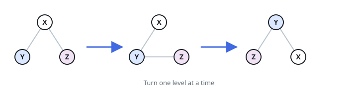
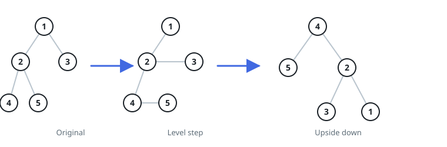

# Topple The Tree

## Description

A binary tree of a particular shape arrives: walking down from the
`root`, every right-hand child hangs beside a left-hand sibling and
never has children of its own, so all the branching lives along the
left edge. Topple the whole tree onto that left edge and return the
root of the resulting tree.

Toppling one knot works like this — its left child rises to take the
parent's place, the old parent swings down to become that newcomer's
right child, and the old right child tucks in as the newcomer's left
child:



The same three-way swap repeats one knot at a time all the way down the
original left edge, each swap consuming the next knot of the spine,
until the original leftmost node stands as the new root.

### Example 1



```text
Input: root = [1,2,3,4,5]
Output: [4,5,2,null,null,3,1]
Explanation: The spine 1 → 2 → 4 is walked to its end, so 4 becomes the
new root; then 2 takes 1's place as 4's right child with 3 tucked left,
and 1 finally hangs as 2's right child.
```

### Example 2

```text
Input: root = [2,1,3]
Output: [1,3,2]
Explanation: The single swap lifts 1 to the root, keeps 3 on its left,
and drops the old root 2 on its right.
```

### Example 3

```text
Input: root = [3,2,4,1]
Output: [1,null,2,4,3]
Explanation: The swap runs twice down the spine 3 → 2 → 1, so the
leftmost node 1 ends on top, 2 becomes its right child, and 2 in turn
carries 4 on its left and 3 on its right.
```

### Constraints

- The tree holds between `0` and `10` nodes.
- `1 <= Node.val <= 10`
- Every right node in the tree has a sibling (a left node sharing its
  parent).
- Every right node in the tree has no children.
