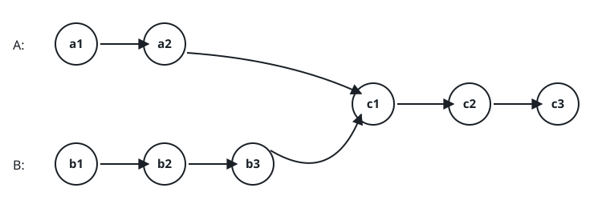
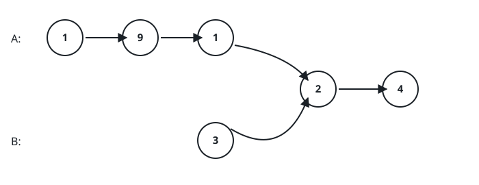
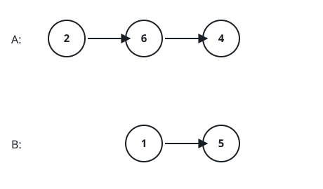

# Where Two Lists Converge

## Description

Two singly linked lists are handed to you by their heads, `headA` and
`headB`. Their nodes are ordinary chains of `val`/`next` pairs, but the two
lists are allowed to share a stretch of physical nodes: past some point they
are literally the same chain in memory, not two copies that happen to hold
equal values. Return the first node that both walks reach — the join node
itself — or `null` when the lists never actually touch.

The judge builds this shared structure for you. List `A` arrives as a plain
value sequence; list `B` is described by its own private prefix plus the
position `splice_at` in `A` where that prefix is stitched on, so `headB`
becomes a head whose chain runs through B's prefix and then continues along
A's suffix. When `splice_at` equals A's length the stitch lands past the end
and the two lists stay completely separate.

Two rules hold in every test: the whole linked structure is acyclic, and
your function must leave it exactly as it found it — relinking nodes is not
allowed.

### Example 1



```text
Input: headA = [4,1,8,4,5], headB = {"values": [5,6,1], "splice_at": 2}
Output: [8,4,5]
Explanation: B's prefix 5→6→1 is stitched onto A at index 2, so from there
both heads traverse the very same 8→4→5 nodes. The join node is the 8, and
reading from it gives [8,4,5]. The two 1s earlier in each walk are distinct
nodes that merely share a value — they are not the meeting point.
```

### Example 2



```text
Input: headA = [1,9,1,2,4], headB = {"values": [3], "splice_at": 3}
Output: [2,4]
Explanation: B consists of the single node 3, whose next pointer lands on
A's node at index 3. The shared region therefore starts at the 2.
```

### Example 3



```text
Input: headA = [2,6,4], headB = {"values": [1,5], "splice_at": 3}
Output: []
Explanation: The splice position equals A's length, so nothing is joined;
the lists run side by side and the answer is null, rendered as an empty
list.
```

### Constraints

- Let `m` be the number of nodes in list A and `n` the length of B's own
  prefix.
- `1 <= m <= 3 * 10⁴`
- `0 <= n <= 3 * 10⁴`
- `0 <= splice_at <= m`
- `1 <= Node.val <= 10⁵`
- The entire linked structure contains no cycles.

### Follow-up

Can you find the join node in `O(m + n)` time while allocating nothing
beyond a couple of pointers?
