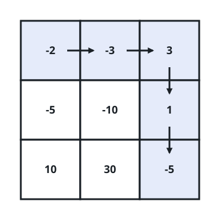

# The Minimum Starting Health

## Description

A knight sets out to cross an `m x n` grid of dungeon rooms, entering at
the top-left corner, where a princess is held in the bottom-right one. Each
step of the crossing moves a single room to the right or a single room
down — never upward, never back.

Health is the whole game. Before setting foot inside, the knight picks a
starting amount of health, and every room has an effect on arrival: a
negative value is a demon's toll that drains that much health, a positive
value is an orb that restores that much, and `0` leaves things unchanged.
The instant the knight's health sits at `0` or below, the crossing is over
and failed.

Choose the smallest starting health that still lets some right-and-down
path reach the princess alive, and report it.

Neither endpoint is special: the very first room entered and the room
holding the princess apply their effects like any other.

### Example 1



```text
Input: grid = [[-2,-3,3],[-5,-10,1],[10,30,-5]]
Output: 7
Explanation: The dungeon is laid out as:
 -2 (K)  -3      3
 -5      -10     1
 10      30     -5 (P)
Along the path RIGHT -> RIGHT -> DOWN -> DOWN a start of 7 suffices: the
knight's health runs 5, 2, 5, 6, then 1 after the final toll. Any smaller
start dips to zero somewhere along the way.
```

### Example 2

```text
Input: grid = [[-3,5],[8,-2]]
Output: 4
Explanation: Whichever corner the path bends at, the opening toll of -3
must be survived with 1 health to spare, which takes 4.
```

### Example 3

```text
Input: grid = [[1,-3,2],[-4,1,5]]
Output: 3
Explanation: Every path opens on the +1 room. Bending down right away
then meets the -4 toll and needs 4; the two routes that meet -3 instead
manage with 3.
```

### Constraints

- `m == grid.length`
- `n == grid[i].length`
- `1 <= m, n <= 200`
- `-1000 <= grid[i][j] <= 1000`
