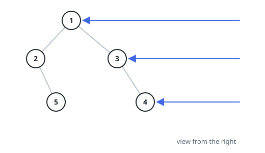
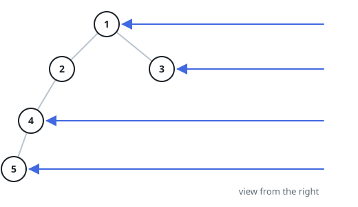

# Seen From The Right Edge

## Description

Look at a binary tree sideways, from its right edge: at every depth
exactly one node is visible — the rightmost node living at that depth.
Report what an observer standing there sees, walking the tree from the
root downward, as one list of those visible values.

### Example 1

```text
Input: root = [1,2,3,null,5,null,4]
Output: [1,3,4]
```



### Example 2

```text
Input: root = [1,2,3,4,null,null,null,5]
Output: [1,3,4,5]
```



### Example 3

```text
Input: root = [2,1,4,null,null,3,6]
Output: [2,4,6]
Explanation: Level by level, the rightmost survivors are 2, then 4,
then 6.
```

### Example 4

```text
Input: root = []
Output: []
Explanation: An empty tree shows nothing from any side.
```

### Constraints

- The tree holds between 0 and 100 nodes.
- Every node's value lies between `-100` and `100`.
